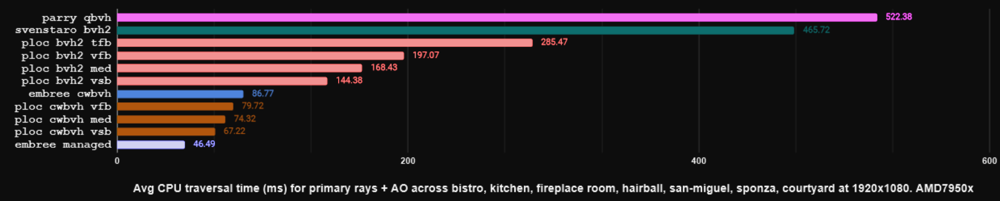
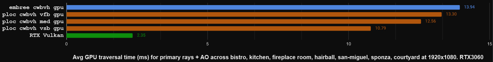
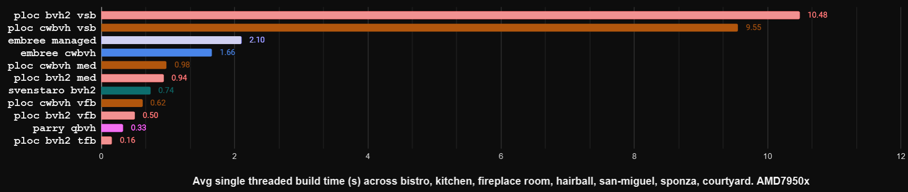
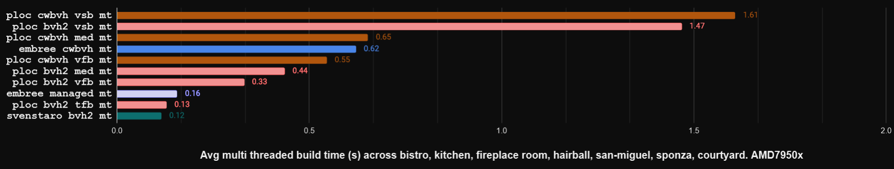

# Tray Racing

Ray Tracing / BVH Building benchmark and tuning utility for [OBVHS](https://github.com/DGriffin91/obvhs).

**TLDR:**
- For best on CPU: [Embree managed](https://www.embree.org/api.html) (where embree fully manages the scene, BVH building/traversal, etc...). 
- For best on GPU: Vulkan/DX12 hardware ray tracing.

[OBVHS](https://github.com/DGriffin91/obvhs) exists for cases where neither of those are an option: GPU traversal on older GPUs, finer control needed over BVH building/traversal, don't want to depend on Embree, etc...

GPU timings are via GPU timestamp queries with locked clocks. 

Notes:
- tfb/vfb/med/vsb are presets in [OBVHS](https://github.com/DGriffin91/obvhs). tfb: fastest_build, vfb: very_fast_build, med: medium_build, vsb: very_slow_build. 
- Embree CWBVH uses a BVH8 builder with `RTCBuildQuality::HIGH`. 
- Embree managed is limited to SSE2 as OBVHS does not yet have AVX support. (Embree managed is a bit faster with AVX but not dramatically. OBVHS will eventually also add AVX support)

All times are in (milli)seconds. Less is better.




*Last updated on 2/1/26*

Test Scenes:

- [Bistro](https://developer.nvidia.com/orca/amazon-lumberyard-bistro) `3,872,303 tris` 
- [Kitchen](https://github.com/DGriffin91/tray_racing/blob/main/assets/obj/kitchen.obj) `56,939 tris` 
- [Fireplace Room](https://casual-effects.com/data/) `143,107 tris` 
- [Hairball](https://casual-effects.com/data/) `2,880,000 tris` 
- [San Miguel](https://casual-effects.com/data/) `5,075,977 tris` 
- [Sponza](https://www.intel.com/content/www/us/en/developer/topic-technology/graphics-research/samples.html) `3,746,636 tris` 
- [Courtyard](https://www.unrealengine.com/marketplace/en-US/product/middle-eastern-courtyard) `612,205 tris` 
- [Caldera Hotel 01](https://github.com/Activision/caldera) `19,261,109 tris`

For GPU benchmarking, please lock GPU/VRAM clocks: [NVIDIA Instructions.](https://developer.nvidia.com/blog/advanced-api-performance-setstablepowerstate/)
GPU benchmarking requires [dxc](https://github.com/microsoft/DirectXShaderCompiler) to be in `path`.

Example:
`cargo run --release -- -i "assets/scenes/kitchen.ron" --benchmark --build ploc_cwbvh`

```
USAGE:
    tray_racing [FLAGS] [OPTIONS] -i <input>

FLAGS:
        --animate                          Animate noise seed, etc...
        --auto-tune                        Find best settings for the given scenes.
        --benchmark                        Runs timestamp queries and extra dispatches to try to normalize timings.
        --cpu                              Render on the CPU
        --disable-auto-tune-model-cache    Bypass model cache (eg. if not all models will fit in memory at once)
        --flatten-blas                     Use tlas building/traversal path but flatten model into 1 blas.
        --hardware                         Use Vulkan hardware RT (requires --hardware feature and alternate wgpu, see
                                           cargo.toml)
    -h, --help                             Prints help information
        --png                              Save a png of the rendered frame. (Currently only cpu mode)
        --split                            Split large tris into multiple AABBs
        --tlas                             Use tlas (top level acceleration structure)
    -V, --version                          Prints version information
        --verbose                          Prints misc info about BVH (depth, node count, etc..)

OPTIONS:
        --build <build>
            Specify BVH builder [default: ploc_cwbvh]  [possible values: ploc_cwbvh, ploc_bvh2, embree_cwbvh,
            embree_bvh2_cwbvh, embree_managed, svenstaro_bvh2, parry_bvh]
    -i <input>
            Input file path, also supports multiple comma separated paths (use with benchmark & render-time). Use
            `demoscene` for included procedurally generated scene.
        --max-prims-per-leaf <max-prims-per-leaf>
            Maximum primitives per leaf. For CWBVH the limit is 3 [default: 3]

        --post-collapse-reinsertion-batch-ratio-multiplier <post-collapse-reinsertion-batch-ratio-multiplier>
            For BVH2 only, a second pass of reinsertion after collapse. Since collapse reduces the node count, this
            reinsertion pass will be faster. 0 to disable. Relative to the initial reinsertion_batch_ratio. [default:
            0.0]
        --preset <preset>
            Overrides BVH build options. [default: ]  [possible values: , fastest_build, very_fast_build, fast_build,
            medium_build, slow_build, very_slow_build]
    -r <reinsertion-batch-ratio>
            Typically 0..1: ratio of nodes considered as candidates for reinsertion. Above 1 to evaluate the whole set
            multiple times. A little goes a long way. Try 0.01 or even 0.001 before disabling for build performance.
            [default: 0.15]
        --render-time <render-time>
            Stop rendering the current scene after n seconds. [default: 0]

        --search-depth-threshold <search-depth-threshold>
            Below this depth a search distance of 1 will be used for ploc. [default: 2]

        --search-distance <search-distance>
            In ploc, the number of nodes before and after the current one that are evaluated for pairing. 1 has a fast
            path in building and still results in decent quality BVHs esp. when paired with a bit of reinsertion.
            [default: 14]  [possible values: 1, 2, 6, 14, 24, 32]
        --sort-precision <sort-precision>
            Bits used for ploc radix sort. [default: 64]  [possible values: 64, 128]
        --width <width>                                      Render resolution width. [default: 1920]
        --height <height>                                    Render resolution height. [default: 1080]
```

MIT & Apache 2.0 Licenses don't apply to assets.
